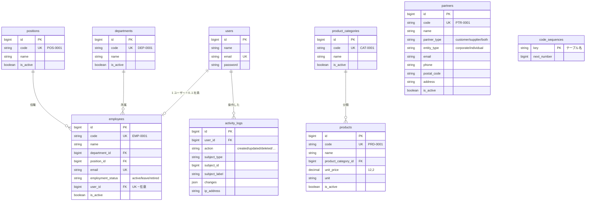

# crm-sales — CRM（営業・売上管理システム）

**BtoB 法人営業向けの顧客・商談・売上管理システム**（Laravel 13 / PHP 8.3 / PostgreSQL 16 / Docker）

顧客（会社・担当者）〜商談〜明細で金額を積み上げて一元管理し、
**売上・見込み金額の可視化**と**内税管理（税率の時点保全）による金額の正確性**を主役に据えた業務システムです。

業務システム共通基盤 **laravel-business-template**（認証・権限・マスタ・一覧基盤・監査ログ・ダッシュボードの枠までを作り込んだ自作テンプレート）をベースに、
CRM 固有のテーブルと画面を足す形で構築しています。基盤側の設計は
[このテンプレの位置づけ](#このテンプレの位置づけ)以降にそのまま残してあります。

---

## 想定クライアントと課題

**アルティス・ソリューションズ株式会社**（架空）— BtoB 向けにシステム開発・広告・人材サービスを提供する中小企業。
従業員数十名、営業担当 8 名。実在の企業・ロゴとは関係ありません。

| 課題 | このシステムでの解き方 |
| --- | --- |
| 顧客・商談・売上の情報が担当者ごとに分散し、会社全体の売上が把握しづらい | 顧客〜商談〜明細を 1 か所に集約し、ダッシュボードと一覧サマリで会社全体の数字を出す |
| 商談の進捗が可視化されておらず、受注見込みが読めない | ステータス（見込み/提案中/見積提示/受注/失注）と確度で管理し、パイプラインと加重見込みを表示 |
| 金額・税の管理が属人的で、確定した売上金額の正確性に不安がある | 内税（税込）で統一し、端数処理を 1 か所に固定。明細は確定時点の単価・税率をコピー保持 |

## デモアカウント

`php artisan migrate:fresh --seed` で、3 ロールぶんのアカウントとデモデータが入ります。パスワードはいずれも `password`。

| ロール | ログイン | できること |
| --- | --- | --- |
| 管理者 | `admin@example.com` | すべて。**削除済みデータの表示・復元**、ユーザーのロール変更、**操作ログ**の閲覧 |
| 担当者 | `staff@example.com` | 顧客・商談・明細・活動・マスタの**登録／編集**、CSV 出力。削除済みの復元と操作ログは不可 |
| 閲覧者 | `viewer@example.com` | **閲覧と CSV 出力のみ**。ダッシュボードの金額も見えるが、登録・編集ボタンは出ない |

権限の差は画面で隠すだけでなくルート側でも検査しているため、URL を直接開いても 403 になります。

デモデータの規模：**顧客 44 社 / 先方担当 85 名 / 商談 320 件 / 明細 722 行 / 活動履歴 627 件 / 社員 28 名 / 商品 21 件**。
受注は直近 12 か月に分散し（月次推移グラフが自然に見えるように）、約 3 割の商談に軽減税率 8% の明細が混ざります（税率別の内訳が確認できるように）。
乱数を固定しているため、`migrate:fresh --seed` を何度実行しても同じデータが再現されます（受注日などは実行日を基準にした相対日付です）。

## できること

| 分類 | 機能 |
| --- | --- |
| **顧客管理** | 顧客（会社）一覧（累計売上・進行中商談金額つき）／顧客詳細（概要・担当者・商談・活動のタブ）／先方担当のインライン追加・編集・無効化 |
| **商談管理** | 商談の登録・編集（顧客・先方担当・営業担当・ステータス・確度・予定クローズ日・受注日）／一覧（絞り込み連動の金額サマリ）／詳細（金額内訳・活動履歴） |
| **明細と金額計算** | 商品を選ぶと税込単価と税率を引き当て、数量入力で税込金額を算出。消費税は税率ごとに 1 回だけ切り捨てて逆算 |
| **活動履歴** | 電話 / 訪問 / メール / メモ を商談・顧客に記録。商談詳細からインラインで追加 |
| **売上ダッシュボード** | KPI（今月の受注・受注見込み・進行中件数・受注残）／月次売上推移（12 か月）／担当者別売上／パイプライン |
| **税率マスタ** | 税率を適用開始日で世代管理。商品の標準税率を紐付け、未選択なら既定の標準税率を自動設定 |
| **共通機能**（基盤から継承） | 認証・ロール権限・検索／絞り込み／ソート／ページング・CSV 出力・論理削除と復元・監査ログ・テーマ差し替え |

## 画面一覧

| 画面 | URL | 主な内容 |
| --- | --- | --- |
| ダッシュボード | `/dashboard` | 売上 KPI 4 枚、月次売上推移、担当者別売上、パイプライン（ステータス別） |
| 顧客一覧 | `/customers` | 得意先の一覧。累計売上・進行中商談・商談数。CSV 出力 |
| 顧客詳細 | `/customers/{id}` | 金額サマリ＋会社情報／担当者（インライン管理）／商談／活動履歴のタブ |
| 商談一覧 | `/deals` | **表 / カンバン（パイプライン）** を切り替え可能。絞り込み結果に連動するサマリ（件数・税込合計・受注済み・加重見込み＋**ステータス別の内訳バー**）。ステータス・**顧客/営業担当（入力で絞るコンボボックス）**・**期間**・確度で絞り込み。**保存ビュー（マイビュー）**でワンクリック呼び出し。CSV に消費税・税抜も出力 |
| 商談詳細 | `/deals/{id}` | 1 ページ集約。金額カード ＋ **次アクション** ＋ タブ（概要／明細／活動）。金額内訳（税込／うち消費税／税抜）と**税率別の内訳**、活動のモーダル追加 |
| 商談 登録／編集 | `/deals/create` `/deals/{id}/edit` | 商談情報と明細行の編集。入力に応じて金額を即時表示（保存はサーバ側で再計算） |
| 税率マスタ | `/masters/tax-rates` | 税率の世代管理（名称・税率%・適用開始日） |
| 共通マスタ | `/masters/*` | 社員 / 取引先 / 商品 ＋ サブマスタ（部署 / 役職 / 商品分類） |
| ユーザー管理・操作ログ | `/users` `/activity-logs` | 管理者のみ |

## 設計のポイント（この CRM で作り込んだところ）

- **内税の端数処理を「税率グループ単位で 1 回だけ」に固定した**（帳簿との整合）
  消費税は `税込金額 − 税込金額 ÷ (1 + 税率)` を切り捨てて求めますが、**明細ごとに切り捨てると税率ごとの合計と 1 円ずれます**。
  例：税込 1,000 円の明細 2 行（10%）は 90 + 90 = 180 円ではなく、2,000 円に対して 1 回計算した **181 円**が正。
  実装は [`App\Support\Crm\TaxCalculator`](app/Support/Crm/TaxCalculator.php) の 1 か所に閉じ込め、
  明細ごとの内訳はグループの消費税額を按分して「合計が必ず一致する」形で保存しています。整数演算のみで丸めるため浮動小数の誤差も出ません。

- **商談明細に「税込単価」と「税率%」をスナップショットとしてコピーし、過去データを保全する**
  商品マスタの単価や税率マスタの税率を後から変えても、確定済み商談の金額は動きません。
  税率マスタは書き換えず、適用開始日の新しいレコードを足して世代管理します（例：2026-10-01 から 12%）。
  新しく追加した明細だけが新しいマスタ値を拾います。

- **商談合計（非正規化カラム）は必ずサーバ側で再計算する**
  `deals.amount_total` は一覧・集計を速くするための非正規化ですが、値は画面から受け取らず
  [`Deal::recalculateAmounts()`](app/Models/Deal.php) が明細から計算し直して保存します。
  明細の追加・更新・削除はモデルイベントから拾うので、画面・シーダー・バッチのどの経路でも合計がずれません。
  画面側の即時計算はあくまで表示補助です。

- **一覧・ダッシュボードの集計を「データ量に依存しない固定クエリ本数」で実装した**
  顧客ごと・月ごと・担当者ごとにクエリを回さず、相関サブクエリと条件付き集計にまとめています（実測値は下表）。
  クエリ本数が増えていないことはテストで固定しているので、うっかり N+1 を書くと CI が落ちます。

### 集計クエリの本数（実測）

| 画面 | クエリ本数 | 内訳 |
| --- | --- | --- |
| ダッシュボード | **4** | KPI 4 種 / 月次推移 / 担当者別 / パイプライン が各 1 本 |
| 顧客一覧 | **2** | 件数 ＋ 本体（累計売上・進行中商談・商談数は相関サブクエリで同時取得） |
| 顧客詳細 | **6** | 金額サマリは条件付き集計で 1 本。残りは担当者・商談・活動の取得 |
| 商談一覧 | **9** | 件数 ＋ 本体 ＋ 関連の eager load 3 本 ＋ サマリ 1 本 ＋ 絞り込みの選択肢 2 本 ＋ 保存ビュー 1 本 |
| 商談カンバン | **8** | 列ごとの上位 N 件を 1 本（ウィンドウ関数）＋ 本体 ＋ eager load 2 本 ＋ サマリ 1 本 ＋ 絞り込みの選択肢 2 本 ＋ 保存ビュー 1 本 |
| 　└ 顧客が 100 件超のとき | **9** | 候補は上限 + 1 件だけ読んで判定するので、非同期モードに切り替わっても本数は変わらない |
| 商談詳細 | **9〜11** | 商談・顧客・先方担当・営業担当・明細・商品・税率・活動とその実施者の eager load（関連の有無で増減。明細や活動が増えても変わらない） |

いずれも**行数が増えても本数は変わりません**（顧客 2 → 12 社、商談 3 → 15 件、ダッシュボードは商談 +30 件・担当者 +5 名で検証）。
計測は `DashboardTest` / `CustomerScreenTest` / `DealScreenTest` のクエリ本数テストで行っています。

## 5 分で動かす

必要なのは **Docker Desktop だけ**です（PHP / Composer / Node.js のインストールは不要）。

```bash
git clone git@github.com:koutadev/crm-sales.git && cd crm-sales
docker compose up -d                                    # 初回は composer install / npm build で数分
docker compose exec app php artisan migrate:fresh --seed  # デモデータ投入
open http://localhost:8080                              # admin@example.com / password
```

詳しい手順・ポート・トラブルシューティングは[セットアップ](#セットアップ)以降にあります。

## 共通基盤の UI を取り込む

画面まわり（左サイドナビ・ボタン・フォーム・コンボボックス・カレンダー・日付範囲・
モーダル・テーブル・トースト）は、共通基盤 `laravel-business-template` で作ったものを
**取り込んで**使っています。取り込みはスクリプト 1 本です。

```bash
bin/sync-shared-ui.sh --check   # 共通基盤との差分を見る（取り込まない）
bin/sync-shared-ui.sh           # 取り込む
npm run build && composer ci    # 取り込んだら必ず通す
```

- 対象は「業務によらない共通部分」だけです（`app/Support/{Ui,Navigation,DataTable,Masters}`、
  `resources/views/components`、`resources/js`、共通レイアウトなど）。
  CRM 固有の画面（`resources/views/crm/`、商品・税率のマスタ画面、商談・顧客のコントローラ）は対象外です
- 取り込んだファイルは**このリポジトリにコミット**されるので、CI に共通基盤は要りません
- CRM 側の差し替えは 2 つだけです。`CrmNavigationMenu`（営業セクションと税率マスタを追加）と
  `CrmMasterCatalog`（マスタ管理ハブに税率カードを追加）を `AppServiceProvider` で bind しています
- 共通部分に手を入れたくなったら、**共通基盤側を直してから同期**してください（次回の同期で戻ってしまうため）

## 基本設計書

想定クライアント・スコープ・機能／画面一覧・**ER 図**・金額と税の設計は、基本設計書にまとめています。
実装はこの設計書を正として進めています。

**→ [docs/basic-design.md](docs/basic-design.md)**

## 仮想クライアントの世界観を差し替える

サービス名・キャッチコピー・配色は `.env` の 4 行で切り替えられます（**アセットの再ビルドは不要**）。
現在は架空の「アルティス・ソリューションズ」向けの設定です。

```dotenv
APP_NAME="アルティス営業管理"
THEME_TAGLINE="アルティス・ソリューションズ 営業支援"
THEME_PRIMARY="#0f766e"   # ボタン・リンク・選択中メニュー・グラフ 1 色目
THEME_ACCENT="#ea580c"    # グラフ 2 色目などの補助色
# THEME_LOGO="images/logo.svg"
```

書き換えたら `docker compose exec app php artisan config:clear` で反映されます。
仕組みの詳細は[テーマを差し替える](#テーマを差し替える)を参照してください。

## 開発の進めかた（STEP）

| STEP | 内容 | 状態 |
| --- | --- | --- |
| 1 | 共通基盤（`laravel-business-template`）の取り込み | 完了 |
| 2 | 税率マスタ / 商品マスタへの標準税率の紐付け | 完了 |
| 3 | CRM 固有テーブル（`partner_contacts` / `deals` / `deal_items` / `activities`） | 完了 |
| 4 | 顧客管理の画面（一覧・詳細タブ・担当者のインライン管理） | 完了 |
| 5 | 商談 + 明細の登録・編集と内税の金額計算 | 完了 |
| 6 | 商談一覧（絞り込み連動サマリ）・商談詳細（金額内訳・活動履歴） | 完了 |
| 7 | 売上ダッシュボード（KPI・月次推移・担当者別・パイプライン） | 完了 |
| 8 | デモデータ増強・仮想クライアントのテーマ適用・ドキュメント最終反映 | 完了 |
| 9 | UX 刷新：共通デザインシステムの適用（左サイドナビ・共通 UI 部品） | 完了 |

---

以下は、ベースとなっている共通基盤（`laravel-business-template`）のドキュメントです。
CRM 固有の設計は [docs/basic-design.md](docs/basic-design.md) を参照してください。

---

## 目次

1. [このテンプレの位置づけ](#このテンプレの位置づけ)
2. [主要機能（共通基盤）](#主要機能共通基盤)
3. [セットアップ](#セットアップ)
4. [データモデル（ER 図）](#データモデルer-図)
5. [技術選定と設計判断](#技術選定と設計判断)
6. [設計のハイライト](#設計のハイライト)
7. [テーマを差し替える](#テーマを差し替える)
8. [新しいマスタ画面を追加する](#新しいマスタ画面を追加する)
9. [拡張の指針](#拡張の指針)
10. [ディレクトリ構成](#ディレクトリ構成)
11. [トラブルシューティング](#トラブルシューティング)

---

## このテンプレの位置づけ

### 含まれるもの（業務によらず共通の土台）

- ログイン・権限・ユーザー管理
- 全システムが参照する共通マスタ（社員 / 取引先 / 商品）
- どの一覧画面でも使い回せる検索・ページング・ソート・CSV 出力の基盤
- 「誰が何をしたか」を残す監査ログ
- KPI カードとグラフを差し込むだけのダッシュボードの枠
- 顧客ごとに配色とサービス名を変えるテーマの差し替え口
- Docker 開発環境と CI（整形・静的解析・テスト）

### 含まれないもの（業務固有のためテンプレには入れない）

- 業務トランザクション（受注・予約・勤怠打刻 など）とその画面
- 帳票出力・外部システム連携・決済
- SSO / LDAP / 多要素認証、マルチテナント
  （→ [拡張の指針](#拡張の指針) に、必要になったときの入れ方を書いています）

### 現在の状態

共通基盤としては**完成**しています。このリポジトリでは CRM を上に載せた状態で、テスト 168 件・PHPStan level 5・Pint がすべて通る状態を維持しています。

---

## 主要機能（共通基盤）

> CRM としてできることは上の [できること](#できること) を参照してください。ここから下は、土台になっている共通基盤の説明です。

| 分類 | 機能 | 実装の要点 |
| --- | --- | --- |
| **認証** | ログイン / 新規登録 / パスワード再設定 / プロフィール編集 | Laravel Breeze（Blade 版）。新規登録者には既定ロール `viewer` を自動付与 |
| **権限** | ロール 3 種（管理者 / 担当者 / 閲覧者）と 5 種の権限 | spatie/laravel-permission。定義は PHP の enum に一元化 |
| | メニュー・ボタン・ルートの出し分け | 画面で隠すだけでなくルート側でも必ず検査 |
| | ユーザー管理画面 | `user.manage` を持つ管理者がロールを付け替え |
| **共通マスタ** | 社員 / 取引先 / 商品 + サブマスタ（部署 / 役職 / 商品分類） | 業務コードを自動採番（`EMP-0001` 形式） |
| **一覧基盤** | 検索・絞り込み・ページング（20 件）・ソート | 定義クラスを 1 つ書くだけで全機能が揃う |
| | **検索条件の保持** | 別画面へ移動して戻っても条件が残る（セッション保存） |
| | CSV エクスポート | UTF-8 BOM 付き。現在の絞り込みを反映し全件をストリーミング |
| **共通仕様** | 論理削除 / 有効フラグ / 作成者・更新者の自動記録 | `BaseModel` を継承するだけで有効 |
| **監査ログ** | 作成・更新・削除・復元・ログイン / ログアウト | 1 テーブルに集約。変更内容を JSON で保持 |
| **ダッシュボード** | KPI カード + グラフ + 最近の操作 | Chart.js。中身はコントローラから配列で差し替え |
| **テーマ** | サービス名・ロゴ・配色の切り替え | 設定 1 か所。**アセットの再ビルド不要** |
| **日本語化** | バリデーション / 認証 / 画面文言 | `lang/ja` に集約 |
| **品質** | Pint / Larastan(level 5) / PHPUnit 168 件 | GitHub Actions で自動実行 |

---

## セットアップ

必要なものは **Docker Desktop（または Docker Engine + Docker Compose v2）だけ**です。
ホストに PHP / Composer / Node.js をインストールする必要はありません。

### 1. コンテナを起動

```bash
docker compose up -d
```

初回は `app` コンテナのエントリポイントが `.env` の作成 → `composer install` →
`php artisan key:generate` → `npm install && npm run build` を自動実行します（数分）。
`docker compose logs -f app` で `ready to handle connections` が出れば完了です。

### 2. マイグレーションと初期データ

```bash
docker compose exec app php artisan migrate --seed
```

ロールと権限（必須）に加え、動作確認用のユーザーとマスタのサンプルデータが入ります。
サンプルデータは本番環境では投入されません。

### 3. アクセス

<http://localhost:8080>

| ログイン | ロール | できること |
| --- | --- | --- |
| `admin@example.com` | 管理者 | すべて。削除済みの表示・復元、ユーザーのロール変更 |
| `staff@example.com` | 担当者 | マスタの閲覧・登録・編集・削除 |
| `viewer@example.com` | 閲覧者 | マスタの閲覧と CSV 出力のみ |

パスワードはいずれも `password` です。

### コンテナとポート

| サービス | 役割 | ホスト側ポート |
| --- | --- | --- |
| `web` (`crm-web`) | Nginx | **8080** → 80 |
| `app` (`crm-app`) | PHP 8.3-FPM / Composer / Node.js 22 | 5173（Vite 開発サーバー用） |
| `db` (`crm-db`) | PostgreSQL 16 | **5432** |

ポートは `.env` の `APP_PORT` / `FORWARD_DB_PORT` / `VITE_PORT` で変更できます。

### 品質チェック

```bash
docker compose exec app composer ci      # Pint + Larastan + テスト
```

個別に実行する場合:

```bash
docker compose exec app composer lint       # 整形（自動修正）
docker compose exec app composer analyse    # 静的解析
docker compose exec app php artisan test    # テスト
```

### よく使うコマンド

```bash
docker compose exec app bash                              # コンテナに入る
docker compose exec app php artisan migrate:fresh --seed  # DB を作り直す
docker compose exec app php artisan tinker
docker compose exec app npm run dev                       # Vite 開発サーバー（HMR）
docker compose exec db psql -U app -d crm_sales   # DB に接続
docker compose down -v                                    # DB のデータごと削除
```

---

## データモデル（ER 図）



すべての業務テーブルは共通カラムを持ちます（図では省略）:
`is_active` / `created_by` / `updated_by` / `created_at` / `updated_at` / `deleted_at`

> この図は共通基盤から引き継いだテーブルです。CRM 固有のテーブル（`tax_rates` / 今後追加する `deals` など）を含む ER 図は
> [docs/basic-design.md](docs/basic-design.md) の「5. データ設計（ER図）」にあります。

### 将来の業務システムとの関係

| 今後つくるもの | このテンプレのどれを親にするか |
| --- | --- |
| CRM の顧客・商談 | `partners`（法人）、`employees`（担当者） |
| 受発注の伝票 | `partners`（得意先 / 仕入先）、`products`（明細）、`employees`（担当者） |
| 予約 | `partners`（予約者）、`employees`（担当者） |
| 勤怠 | `employees`、`departments` |
| EC | `products`、`product_categories` |

---

## 技術選定と設計判断

### Blade + Alpine.js（Livewire / Inertia を使わない）

業務システムの画面の大半は「一覧・検索・フォーム」であり、SPA が必要になる場面は限られます。
Blade なら**サーバーサイドだけで完結**し、権限による出し分けもテンプレート上で完結します。
学習コストが低く、担当者が代わっても読めることを重視しました。
動きが要る箇所（ドロップダウン、開閉、フラッシュの消去）だけ Alpine.js を使います。

### Laravel Breeze（Jetstream / Fortify 単体ではなく）

必要なのは「ログインできること」だけで、チーム機能や API トークンは不要でした。
Breeze は**生成されたコードがそのまま自分のリポジトリに入る**ため、
SSO や MFA を足したくなったときに追いやすいという利点もあります。

### spatie/laravel-permission（自前実装ではなく）

権限は「あとから粒度が細かくなる」のが常です。
自前の `is_admin` フラグから始めると必ず作り直しになります。
一方で、パッケージ側にロール定義を持たせると分散するため、
**ロールと権限の定義は PHP の enum に集約**し、パッケージは保存と判定にだけ使っています
（`app/Enums/RoleName.php` が唯一の定義元）。

### BaseModel + トレイト（各モデルに都度書かない）

論理削除・作成者記録・監査ログは「全業務テーブルで漏れなく」効いている必要があります。
継承 1 行で全部が有効になる形にすることで、**付け忘れという事故を構造的に防いでいます**。
マイグレーション側も `$table->masterColumns()` の 1 行に揃えました。

### プレフィックス + 連番のコード体系

`EMP-0001` のような業務コードは、電話や紙でのやり取りで使われるため、
UUID や連番 ID ではなく**人が読んで伝えられる形式**が要件になります。
プレフィックスを付けることで、コードを見ただけで対象が分かります。

### PostgreSQL（MySQL ではなく）

JSON 型・部分インデックス・トランザクショナル DDL・厳密な型チェックが標準で使え、
業務データの整合性を守りやすいことを重視しました。
監査ログの `changes` は JSON 列に保存しています。

### テストも PostgreSQL で実行（SQLite インメモリではなく）

SQLite は速い代わりに、JSON 型・`ilike`・制約の挙動が本番と異なります。
**本番と同じエンジンでテストしなければ、テストが通っても本番で壊れます。**
テスト用 DB（`crm_sales_testing`）は DB コンテナの初回起動時に自動作成されます。

### Tailwind CSS 4 + CSS カスタムプロパティ

配色を Tailwind の設定に直接書くと、テーマ変更のたびにアセットの再ビルドが必要になります。
Tailwind 4 のユーティリティは `var(--color-primary)` を参照しているため、
**実行時に CSS 変数を上書きするだけで配色が切り替わる**構成にしました（→ [テーマを差し替える](#テーマを差し替える)）。

---

## 設計のハイライト

業務システムで実際に問題になりやすい箇所への対処をまとめます。

### 1. 採番の重複を行ロックで防ぐ

`code_sequences` テーブルで採番系列ごとにカウンタを持ち、
払い出し時に `SELECT … FOR UPDATE` で行ロックを取ります。
2 人が同時に登録しても `EMP-0005` が 2 件できることはありません。

```php
// app/Support/Code/CodeGenerator.php
return DB::transaction(function () use (...) {
    CodeSequence::query()->insertOrIgnore([...]);            // ON CONFLICT DO NOTHING
    $sequence = CodeSequence::query()->lockForUpdate()->findOrFail($key);
    // …払い出してインクリメント
});
```

削除しても番号は再利用しません（`EMP-0001` を削除しても次は `EMP-0002`）。
採番後にトランザクションが失敗すると欠番が出ますが、
**業務コードは連続性より一意性が重要**なため、これを許容する設計にしています。

データ移行でコードを指定した場合は採番をスキップし、
取り込み後に `CodeGenerator::syncTo('employees', 1500)` でカウンタを合わせられます。

### 2. 監査ログを「付け忘れられない」形にする

コントローラでログを書く設計だと、必ずどこかで書き漏れます。
`LogsActivity` トレイトが Eloquent のモデルイベントを購読し、
**保存経路に関係なく**作成・更新・削除・復元を記録します。

- `password` / `remember_token` は自動的に除外
- 監査カラム（`created_by` / `updated_by`）も除外
  （含めると、復元時に「`updated_by` だけが変わった更新」という無意味なログが増えるため）
- 実質的な変更がない更新は記録しない
- 一括取込などでは `Model::withoutActivityLog(fn () => …)` で抑止できる

### 3. 一覧の共通化を「定義」と「実装」に分ける

各マスタが書くのは**何を出すかの定義だけ**で、
検索・絞り込み・ソート・ページング・削除済みの扱い・CSV は共通実装が担当します。

```php
class EmployeeTable extends TableDefinition
{
    public function query(): Builder { return Employee::query()->with('department:id,name'); }
    public function columns(): array { /* 列と、その列が並び替え可能か */ }
    public function searchable(): array { return ['code', 'name', 'email']; }
    public function filters(): array { /* セレクトボックスの定義 */ }
    public function toCsvRow(Model $model): array { /* CSV 1 行 */ }
}
```

**定義にない列名でのソートは無視します。** `?sort=password` のような URL 直打ちが
そのまま SQL に渡ることはありません。

### 4. 検索条件をセッションに保持する

業務システムでは「一覧で絞り込む → 1 件編集する → 一覧に戻る」を延々と繰り返します。
戻るたびに条件が消えると実用に耐えません。
条件はマスタごとにセッションへ保存し、条件なしで一覧を開いたときに復元します（`?reset=1` でクリア）。

### 5. CSV のインジェクション対策

CSV は Excel で開かれます。`=cmd|'/c calc'!A1` のような値をそのまま出力すると、
**開いた人の PC で数式として実行され得ます**。
先頭が `=` `+` `-` `@` の値にはシングルクォートを付けて無効化しています。
併せて、文字化けを防ぐ UTF-8 BOM と、Excel が期待する CRLF 改行で出力します。

大量データでもメモリを使い切らないよう、`lazy()` で 1 行ずつストリーミングします。

### 6. 権限は「画面で隠す」だけにしない

メニューやボタンは `@can` で隠しますが、それは UI 上の配慮にすぎません。
**ルート側でも必ず権限ミドルウェアで検査**しています。
URL を直接叩いた場合は 403 になることをテストで担保しています。

削除済みの表示・復元も同様で、管理者以外は
`?trashed=only` を付けても削除済みデータが 1 件も返りません。

### 7. is_active と論理削除を使い分ける

| | 意味 | 見え方 |
| --- | --- | --- |
| `is_active = false` | 今後は使わないが、過去データからは参照される | 「無効」として一覧に表示 |
| `deleted_at` あり | 誤登録などで無かったことにしたい | 管理者以外には表示されない |

「退職した社員」は `employment_status = retired` かつ `is_active = false` であって、
削除ではありません。過去の伝票から参照され続けるためです。

### 8. ダッシュボードを「枠」として作る

`DashboardController` は KPI とグラフを**配列で組み立ててビューに渡すだけ**です。
ビューは配列を受け取って並べるだけなので、
各業務システムではコントローラの中身を差し替えればレイアウトはそのまま使えます。

```php
new Kpi(label: '社員', value: 32, unit: '名', href: route('masters.employees.index'));
Chart::doughnut('partner-type', '取引先区分の内訳', ['得意先' => 10, '仕入先' => 11]);
```

Chart.js の設定は PHP 側で組み立て、Blade は `<canvas data-chart="{JSON}">` を置くだけです。
**グラフごとに JavaScript を書く必要はありません。** グラフの色はテーマ設定から取るため、
配色を変えるとグラフも追従します。

### 9. 売上ダッシュボードの集計を 4 クエリにまとめる

ダッシュボードは「今月の受注 / 受注見込み / 進行中の件数 / 受注残」「月次売上推移（直近 12 か月）」
「担当者別売上」「ステータス別の商談金額（パイプライン）」を出しますが、**集計は 4 クエリだけ**です。

| 集計 | クエリ | やり方 |
| --- | --- | --- |
| KPI 4 種 | 1 | `sum(case when … end)` の条件付き集計で 4 つの数字を同時に取る |
| 月次売上推移（12 か月） | 1 | `to_char(ordered_at, 'YYYY-MM')` で GROUP BY。受注が無い月は PHP 側で 0 埋め |
| 担当者別売上 | 1 | `employees` を JOIN して GROUP BY・金額の降順 |
| パイプライン | 1 | `status` で GROUP BY。加重見込み（`sum(floor(amount_total * probability / 100))`）も同じクエリ |

**クエリ本数の実測**：ダッシュボード 1 画面で **4 本**（テストで計測。認証済み・権限キャッシュ済みの状態）。
商談を 30 件・担当者を 5 名増やしても本数は変わりません。
`DashboardTest::the_aggregation_does_not_run_one_query_per_month_or_per_employee` が
「増やす前と後で本数が同じ」ことと「実測値が 4 本」であることの両方を固定しているので、
うっかり月ごと・担当者ごとのループを書くと CI が落ちます。

集計の基準は、売上＝**受注日**（`ordered_at`）、見込み＝**予定クローズ日**、金額はすべて**税込**です。
期間は固定（KPI は当月・推移は直近 12 か月）で、期間フィルタ UI は作っていません。
**拡張可**：`App\Support\Crm\DealMetrics` は基準日と月数を引数で受け取るため、
期間セレクトを足せばそのまま流用できます。

一覧側の集計も同じ方針です。顧客一覧の「累計売上・進行中商談」は相関サブクエリ、
商談一覧の「絞り込み結果の合計」は絞り込み後のクエリに条件付き集計を 1 本足すだけで、
どちらも行数に比例してクエリが増えません。

### 候補の多いマスタの選択（コンボボックス）

顧客・営業担当・商品の選択は、入力で候補を絞る**コンボボックス**です（一覧の絞り込みと商談フォームの両方）。
ひらがな / カタカナ・全角半角・大文字小文字の違いは無視して照合します
（`App\Support\Ui\SearchText`。「こーぽれーと」で「コーポレートサイト制作」に当たります）。
漢字表記の会社名・人名にかなで当てるには読み（カナ）の列が必要なので、そこは今のところ対象外です。

候補の件数によって、2 つのモードを**自動で切り替え**ます。

| 候補の件数 | モード | 動き |
| --- | --- | --- |
| 100 件以下 | 静的 | 候補を画面に埋め込み、ブラウザ側で絞り込む（サーバへの往復なし） |
| 100 件超 | 非同期 | `/options/{customers,employees,products}` へ `?q=` で問い合わせる（250ms のデバウンス、最大 30 件） |

判定のために件数を数えるクエリは足していません（**上限 + 1 件だけ読んで**、超えていたら非同期に倒す）。
非同期モードでも選択中の名前は画面に出るよう、その 1 件だけは別に引いています。

商談フォームの明細行（商品）は、行を増やしても行ごとに独立した部品として動きます。
先方担当は顧客に連動し、顧客を選び直すと候補が入れ替わります。

### 商談詳細（1 ページ集約）

1 つの商談について、**金額・情報・やりとり**が 1 ページで追えるようにしてあります。

| 位置 | 内容 |
| --- | --- |
| 見出し | 件名・商談コード・ステータス。直下に顧客／営業担当／予定クローズ日／受注日 |
| 上部カード | 合計（税込）／うち消費税／税抜／加重見込み（税込 × 確度） |
| 次アクション | **これから予定されている活動のうち、いちばん近いもの**（なければその旨と追加ボタン） |
| 概要タブ | 基本情報（顧客・先方担当・営業担当・ステータス・確度・予定クローズ日・受注日・登録／更新）と金額内訳（**税率別**と合計） |
| 明細タブ | 商品・数量・税込単価・税率・税込金額・うち消費税。フッターに税抜／消費税／合計 |
| 活動タブ | 時系列（新しい順）。これからの予定は「予定」バッジで区別。**追加はモーダルでその場で完結** |

活動を追加すると活動タブを開いた状態で戻り（`?tab=activities`）、入力エラーのときも
活動タブとモーダルが開いた状態で戻ります。次アクションは**取得済みの活動から選ぶだけ**なので
クエリは増えません（明細や活動が増えても本数が変わらないことを `DealDetailTest` で固定）。

### カンバン（パイプライン）表示

商談一覧は、右上のタブで **表 / カンバン** を切り替えられます。表示形式も他の条件と同じように
記憶され、保存ビューにも含まれます（「カンバンで見る進行中の商談」のようなビューが作れます）。

- 列はステータス（見込み → 提案中 → 見積提示 → 受注 → 失注）。**列ヘッダーに件数と税込金額合計**を出します
- カードには 商談コード・件名・顧客・税込金額・確度・予定クローズ日・営業担当。クリックで商談詳細へ
- 絞り込み（顧客・営業担当・期間・確度・キーワード）は表とまったく同じものが効きます
- 列ヘッダーの数字は**絞り込み後の全件**に対する値です（カードは 1 列 50 件まで表示し、超えたぶんは「他 N 件」）

**カードのドラッグ&ドロップでステータスを変更**できます（`master.manage` 権限が必要）。
受注日の扱いは登録・編集画面と同じ規則です。

| 移動先 | 動き |
| --- | --- |
| 受注 | 受注日が空なら今日を記録。**明細が 1 件も無ければ変更できません**（サーバが 422 を返し、カードは元の列に戻ります） |
| 受注以外（失注を含む） | 受注日をクリア |

金額（`amount_total`）は明細から計算されるものなので、ステータス変更では一切触りません（`DealKanbanTest`）。

集計はカードを並べる分も含めて **8 クエリ**。列ごとの上位 N 件はウィンドウ関数
（`row_number() over (partition by status …)`）で 1 本にまとめているので、
商談が増えても列が増えてもクエリ本数は変わりません。

### 表示まわりの決めごと

| 項目 | 決めごと |
| --- | --- |
| 金額 | 桁区切りあり。**単位「円」は KPI カード・凡例など「数字が主役の場所」だけ**に付け、表の中は見出しに「金額(税込)」と書いて数字は素のまま |
| 数字の収まり | KPI カードの数字はカード幅に合わせて縮み、入りきらなければ末尾を省略（ホバーで全桁） |
| 0 件のとき | 一覧・グラフ・内訳バー・カンバンの各列・活動履歴のいずれも「〜がありません」を出す（黙って空欄にしない） |
| 担当者名 | グラフの軸は苗字だけ。同じ姓が複数いる場合はその人だけフルネーム。ツールチップと読み上げは常にフルネーム |
| 色 | ステータスの色は情報を色だけに頼らせない（凡例に必ずラベルと数値を添える）。グラフ・内訳バーの色は白背景で 3:1 以上 |

### 商談一覧の上部サマリ

絞り込み結果に連動して、**件数 / 合計（税込） / 受注済み / 加重見込み** の 4 枚のカードと、
**ステータス別の内訳バー**（見込み → 提案中 → 見積提示 → 受注 → 失注）を出します。
バーは金額と件数を切り替えられますが、**どちらも同じ 1 クエリの結果**なので切り替えで再取得は起きません。

集計は従来どおり「絞り込み後のクエリに条件付き集計を 1 本足すだけ」です。
ステータス別の内訳（5 段階 × 件数・金額）も同じ 1 クエリの中で取っているため、
一覧全体のクエリ本数は **9 本のまま**変わりません（`DealSummaryTest`）。

### 保存ビュー（マイビュー）と条件の記憶

商談一覧の絞り込み（キーワード・ステータス・顧客・営業担当・確度・期間・基準日）と並び順は、
**次に開いたときも保持**されます（セッションに記憶。「条件をクリア」で全件に戻ります）。

よく使う組み合わせは、一覧上部の「ビュー」から名前を付けて保存できます。

| 操作 | 場所 |
| --- | --- |
| 保存（同名で上書き） | ビュー ▸「現在の条件を保存…」 |
| 呼び出し | ビュー ▸ 一覧から選ぶ（`?view=<id>` を開くだけ） |
| 削除 | ビューの一覧で各行の × |
| 既定にする | 保存ダイアログの「既定のビューにする」 |

ビューは**ユーザーごと**です。他人のビューは一覧に出ず、ID を直接指定しても適用されません
（`DealSavedViewTest` / 共通基盤の `SavedViewTest` で固定）。
呼び出しは通常のリクエストと同じ経路を通るので、**上部サマリも CSV も同じ条件**で動きます。

### 商談一覧の期間フィルタ

商談一覧には期間の絞り込みがあります。基準日を **予定クローズ日 / 受注日** から選び、
「今月・今四半期・今年度・過去 N 日」などの相対プリセットかカスタム期間で絞ります
（未指定なら全期間）。相対プリセットは**キーだけを保存してアクセスのたびに計算する**ため、
月をまたいでも「今月」は常にその時点の今月です。

条件は共通一覧基盤の `statefulParameters()` に載せてあるので、他の絞り込みと同じように
前回の状態が保持され、並び替え・ページ送り・CSV にも引き継がれます。
絞り込みはクエリ 1 本の中で完結するため、上部サマリ・一覧・CSV は必ず同じ条件になり、
クエリ本数も増えません（`DealPeriodFilterTest`）。

---

## 静的デモを書き出す

**公開中のデモ： https://crm-demo-static-snowy.vercel.app**
（架空のダミーデータ。保存・出力などサーバが必要な操作は動作しません）

ポートフォリオ用に、**この本体の実画面をそのまま静的サイトとして書き出せます**
（手書きの HTML は作りません。本体を直せば、書き出し直すだけでデモが追随します）。

```bash
docker compose up -d
docker compose exec app npm run build        # アセットを最新に
python3 bin/export-static-demo.py            # → ../crm-demo-static へ書き出し
python3 -m http.server 4173 --directory ../crm-demo-static
```

書き出すのは 6 画面（ダッシュボード / 商談一覧 / 商談カンバン / 商談詳細 / 顧客詳細 / マスタ管理）。
スクリプトがやることは 4 つだけです。

1. デモ用アカウントでログインし、Blade 描画後の HTML を取得する
2. 6 画面どうしのリンクを静的ファイル名へ張り替える
3. それ以外の遷移・送信（CSV 出力・保存ビュー・活動の追加・ドラッグでのステータス変更・非同期検索）は
   `data-demo-disabled` を付けて止め、「このデモでは動作しません」と知らせる
4. ビルド済みアセット（`public/build`）を持っていき、デモの注記バナーを差し込む

対象ページや無効化の挙動は `bin/export-static-demo.py` の先頭に定義してあります。
セッション由来の値（CSRF トークン）は書き出し時に空にしています。

## テーマを差し替える

顧客ごと・システムごとに見た目を変えるための差し替え口です。
**設定を変えるだけで、アセットの再ビルドは不要**です。

### 手順

**1. `.env` を編集する**（`config/theme.php` の既定値を上書きします）

```dotenv
THEME_NAME="Acme 販売管理"
THEME_TAGLINE="株式会社Acme 社内システム"
THEME_PRIMARY="#c026d3"
THEME_ACCENT="#ea580c"
THEME_LOGO="images/acme-logo.svg"   # public/ 配下のパス。未設定なら頭文字マーク
```

**2. 設定キャッシュをクリアする**

```bash
docker compose exec app php artisan config:clear
```

**3. ブラウザを再読み込みする**

以上です。これだけで次がまとめて切り替わります。

- ブラウザのタブ・ヘッダー・ログイン画面の**サービス名**
- ヘッダーとログイン画面の**ロゴ**（未設定ならサービス名の頭文字を使ったマーク）
- ボタン・リンク・選択中メニュー・バッジ・フォーカスリングの**配色**
- **グラフの配色**（1 色目に primary、2 色目に accent）

### 仕組み

`config/theme.php` の色は `<head>` に CSS カスタムプロパティとして注入されます。

```html
<style>:root{--color-primary:#c026d3;--color-accent:#ea580c;}</style>
```

Tailwind 4 のユーティリティ（`bg-primary` など）は `var(--color-primary)` を参照しているため、
この変数を上書きするだけで全体が切り替わります。
ホバー時の色や淡いバッジ背景は `color-mix()` で primary から自動的に派生するので、
指定するのは 2 色だけで済みます。

```css
/* resources/css/app.css */
--color-primary-hover:   color-mix(in oklab, var(--color-primary) 82%, white);
--color-primary-soft:    color-mix(in oklab, var(--color-primary) 12%, white);
--color-primary-soft-fg: color-mix(in oklab, var(--color-primary) 78%, black);
```

`<style>` に直接埋め込むため、設定値は CSS の色として妥当な形式かを検査したうえで出力し、
不正な値は既定色にフォールバックします（`App\Support\Theme\Theme`）。

### 既定テーマ

業務システム向けのニュートラルな配色（インディゴ + シアン）です。
グレースケールを基調に、操作可能な要素だけに色を使う方針にしています。

### さらに踏み込んで変えたい場合

グレー基調そのものやフォントを変える場合は `resources/css/app.css` の `@theme` を編集し、
`npm run build` を実行してください（この場合は再ビルドが必要です）。

---

## 新しいマスタ画面を追加する

1 マスタあたり **定義 1 + コントローラ 1 + ビュー 2 + ルート 1 行**で追加できます。

**① マイグレーションとモデル**

```php
Schema::create('warehouses', function (Blueprint $table) {
    $table->id();
    $table->string('code', 32)->unique();
    $table->string('name', 100);
    $table->masterColumns();   // is_active / created_by / updated_by / timestamps / deleted_at
});
```

```php
class Warehouse extends BaseModel
{
    use HasSequentialCode;

    protected $fillable = ['name', 'is_active'];

    public static function codePrefix(): string
    {
        return 'WHS';   // → WHS-0001
    }
}
```

**② 一覧の定義**（`app/Tables/WarehouseTable.php`）

`TableDefinition` を継承し、列・検索対象・絞り込み・CSV の 1 行を書きます。

**③ コントローラ**（`app/Http/Controllers/Masters/WarehouseController.php`）

`MasterController` を継承すると、一覧・CSV・論理削除・復元は実装済みです。
登録 / 編集フォームの処理だけ書きます。
「コード + 名称」だけのマスタなら `SimpleMasterController` を継承すればそれも不要です
（部署・役職・商品分類がこの形で、画面も 3 マスタで共有しています）。

**④ ルート**（`routes/web.php`）

```php
MasterRoutes::register('warehouses', WarehouseController::class, 'warehouses');
```

一覧・CSV に `master.view`、登録・編集・削除・復元に `master.manage` が自動で設定されます。

**⑤ ビュー**（`resources/views/masters/warehouses/index.blade.php`）

```blade
<x-master-index :table="$table" :resource-label="$resourceLabel" :route-name="$routeName">
    @foreach ($table->items() as $record)
        <tr>
            <td class="px-4 py-3 font-mono text-xs">{{ $record->code }}</td>
            <td class="px-4 py-3">{{ $record->name }}</td>
            <td class="px-4 py-3 text-center"><x-active-badge :active="$record->is_active" /></td>
            <td class="px-4 py-3">{{ $record->updated_at?->format('Y/m/d H:i') }}</td>
            <x-master-row-actions :record="$record" :route-name="$routeName" :resource-label="$resourceLabel" />
        </tr>
    @endforeach
</x-master-index>
```

検索フォーム・ページャ・CSV ボタン・削除済み切り替えは `<x-data-table>` が描画するため書く必要はありません。

### コード体系

| マスタ | 例 | | マスタ | 例 |
| --- | --- | --- | --- | --- |
| 社員 | `EMP-0001` | | 部署 | `DEP-0001` |
| 取引先 | `PTR-0001` | | 役職 | `POS-0001` |
| 商品 | `PRD-0001` | | 商品分類 | `CAT-0001` |

形式は **プレフィックス + `-` + 4 桁ゼロ埋めの連番**。連番はマスタごとに独立しています。
4 桁を超えると自動的に桁が増えます（`EMP-10000`）。画面からの入力・変更はできません。

---

## 拡張の指針

このテンプレは「最小で完成している」状態です。
以下は**あえて入れていない**もので、必要になったときに足せるよう設計してあります。

### 認証方式

| 要件 | 拡張方法 |
| --- | --- |
| SAML / OIDC による SSO | `laravel/socialite` + `socialiteproviders` を追加し、ログイン導線を差し替える |
| LDAP / Active Directory | `directorytree/ldaprecord-laravel` を追加し、認証ドライバを差し替える |
| 多要素認証（MFA / TOTP） | `laravel/fortify` の二要素認証を有効化する |
| メールアドレス確認の必須化 | `App\Models\User` に `MustVerifyEmail` を実装する |

Breeze は生成コードがリポジトリ内にあるため、置き換えではなく**追記**で対応できます。

### 権限をマスタ単位に分割する

現在は全マスタを `master.view` / `master.manage` の 2 権限で制御しています。
「社員マスタは人事だけ、取引先マスタは営業だけ」のように分ける場合:

1. `app/Enums/PermissionName.php` に `employee.view` / `employee.manage` などを追加し、
   `RoleName::permissions()` を更新
2. `app/Support/Routing/MasterRoutes.php` の `register()` が権限名を引数で受け取れるようにし、
   `routes/web.php` からマスタごとに指定

画面側は `@can('...')` の権限名を変えるだけです。

削除済みの表示・復元は現在「admin ロールかどうか」（`User::isAdmin()`）で判定しています。
専用の権限に変える場合は `MasterController::canManageDeleted()` の 1 メソッドを差し替えてください。

### マルチテナント（会社・部署単位のデータ分離）

未実装です。導入する場合は、`BaseModel` にグローバルスコープを追加して
テナント ID による絞り込みを全モデルへ一括で効かせるのが、この構成では最も破綻しにくい方法です。
`masterColumns()` にテナント列を足せば、マイグレーション側も 1 か所で揃います。

### その他

| 要件 | 方針 |
| --- | --- |
| CSV インポート | `HasSequentialCode` はコード指定時に採番をスキップするため取込に対応済み。画面とエラー行の表示のみ追加が必要 |
| 添付ファイル | ストレージ方針（ローカル / S3）を決めたうえで `config/filesystems.php` を設定 |
| 伝票番号の採番 | `CodeGenerator` は系列キーを自由に取れるため、`sales_orders:2026` のような年度別キーで年度リセットにも対応可能 |
| 本番デプロイ | 現在の Dockerfile は開発用（バインドマウント・`APP_DEBUG=true`）。本番はマルチステージビルドと opcache 最適化、キュー worker の分離が必要 |

---

## ディレクトリ構成

```
app/
├── Enums/                      # ロール / 権限 / 業務区分の定義
│   ├── RoleName.php            #   ロールと保有権限（唯一の定義元）
│   ├── PermissionName.php
│   ├── EmploymentStatus.php    #   在籍 / 休職 / 退職
│   ├── PartnerType.php         #   得意先 / 仕入先 / 両方
│   └── EntityType.php          #   法人 / 個人
├── Http/
│   ├── Controllers/
│   │   ├── DashboardController.php   # ダッシュボードの枠
│   │   ├── Masters/                  # マスタ画面（MasterController が共通処理）
│   │   └── UserController.php        # ロール管理
│   └── Requests/Masters/             # 入力チェック
├── Models/
│   ├── BaseModel.php           # 業務テーブル用の基底モデル
│   ├── Employee.php / Partner.php / Product.php
│   ├── Department.php / Position.php / ProductCategory.php
│   ├── ActivityLog.php / CodeSequence.php
│   └── Concerns/               # 共通仕様のトレイト
│       ├── HasSequentialCode.php   #   コード自動採番
│       ├── HasActiveFlag.php       #   有効フラグ
│       ├── HasAuditColumns.php     #   created_by / updated_by
│       └── LogsActivity.php        #   監査ログ
├── Support/
│   ├── Code/CodeGenerator.php  # 採番（行ロック）
│   ├── DataTable/              # 共通一覧基盤
│   ├── Dashboard/              # KPI / グラフの値オブジェクト
│   ├── Routing/MasterRoutes.php
│   └── Theme/Theme.php         # テーマ差し替え口
└── Tables/                     # 各マスタの一覧定義

config/
├── theme.php                   # サービス名・ロゴ・配色
└── activity_log.php            # 監査ログの ON/OFF

resources/
├── css/app.css                 # Tailwind 4 + テーマトークン
├── js/{app.js,charts.js}       # Alpine.js / Chart.js
└── views/
    ├── components/             # data-table / master-index / dashboard など共通部品
    ├── masters/                # 各マスタ画面（simple/ は 3 サブマスタで共有）
    ├── partials/theme.blade.php
    └── users/

docker/                         # Dockerfile / nginx / postgres 初期化
lang/ja/                        # 日本語メッセージ
tests/                          # 99 件
.github/workflows/ci.yml
phpstan.neon / pint.json
```

### CI

`main` への push と Pull Request で以下を実行します。

1. Pint による整形チェック
2. Larastan による静的解析（PHPStan level 5）
3. PostgreSQL 16 を起動して `php artisan test`

### データベース接続情報

| 項目 | コンテナ内から | ホスト（GUI ツール）から |
| --- | --- | --- |
| ホスト | `db` | `localhost` |
| ポート | `5432` | `5432`（`FORWARD_DB_PORT`） |
| データベース | `crm_sales` | 同左 |
| ユーザー / パスワード | `app` / `secret` | 同左 |

テスト用: `crm_sales_testing`（DB コンテナ初回起動時に自動作成）

---

## トラブルシューティング

**ポートが既に使われている**
`.env` の `APP_PORT`（既定 8080）や `FORWARD_DB_PORT`（既定 5432）を変更し、
`docker compose down && docker compose up -d` を実行してください。

**Vite manifest not found と表示される**
`docker compose exec app npm run build` を実行してください。

**テーマを変えたのに反映されない**
`docker compose exec app php artisan config:clear` を実行してください。

**ログイン後に 403 が表示される**
そのユーザーにロールが割り当てられていません。管理者が `/users` から割り当てるか、次で付与します。

```bash
docker compose exec app php artisan tinker
>>> App\Models\User::where('email', 'foo@example.com')->first()->assignRole('admin');
```

**テストが「database ... does not exist」で失敗する**
テスト用 DB は DB コンテナの初回起動時のみ作成されます。既存ボリュームの場合は手動で作成します。

```bash
docker compose exec db psql -U app -d crm_sales -c 'CREATE DATABASE crm_sales_testing OWNER app;'
```

**Linux でファイルの所有権が root になる**

```bash
UID=$(id -u) GID=$(id -g) docker compose build --no-cache app
docker compose up -d
```

**環境を完全に作り直したい**

```bash
docker compose down -v
rm -rf vendor node_modules public/build
docker compose up -d
docker compose exec app php artisan migrate --seed
```
