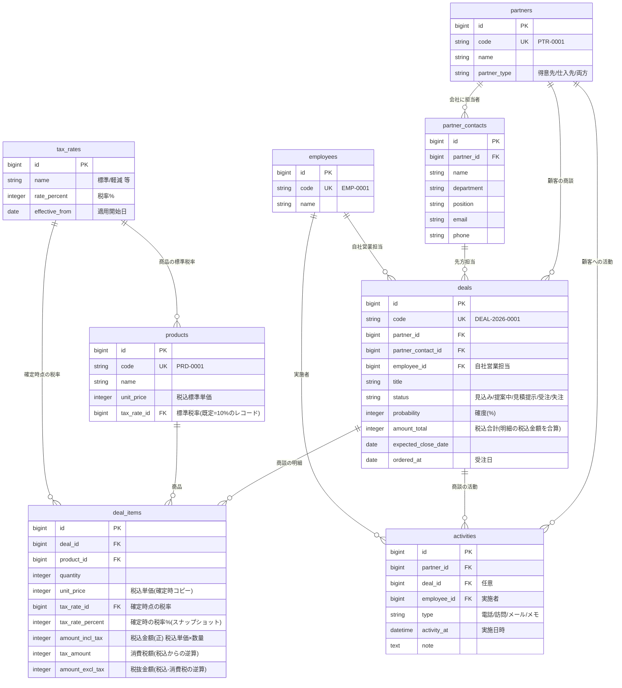

# CRM（営業・売上管理）基本設計書

> 業務システム共通基盤（`laravel-business-template`）を土台に構築する、BtoB法人営業向けの顧客・商談・売上管理システム。

## 1. 想定クライアント・課題

**想定クライアント**：**アルティス・ソリューションズ株式会社**（架空）— BtoB 向けにシステム開発・広告・人材サービスを提供する中小企業。従業員数十名、営業担当 8 名。実在の企業・ロゴとは関係ない。

**課題**：
- 顧客・商談・売上の情報が担当者ごとに分散し、会社全体で「いくら売れているか／これからいくら見込めるか」を把握しづらい。
- 商談の進捗（どの案件がどの段階か）が可視化されておらず、受注見込みが読めない。
- 金額・税の管理が属人的で、確定した売上金額の正確性に不安がある。

**このシステムの狙い**：顧客〜商談〜明細で金額を積み上げて一元管理し、一覧・詳細・ダッシュボードの各層で数値を確認しやすくする。特に**売上・見込み金額の可視化**と**金額の正確性（内税管理・税率の時点保全）**を主役に据える。

## 2. スコープ

**やること**：顧客（会社）と担当者個人の管理、商談（案件）とその明細による金額管理、営業プロセス（パイプライン）管理、活動履歴、売上ダッシュボード、税率マスタによる内税管理。

**やらないこと（今回のスコープ外）**：請求・入金消込、見積書/請求書のPDF発行、メール送信、他システム連携、複数通貨。※将来の拡張余地として設計上は妨げない。

## 3. 主要機能一覧

- **顧客管理**：会社（`partners`を利用）と担当者個人（`partner_contacts`）。顧客詳細で累計売上・進行中商談金額・受注残を集計表示。
- **商談管理**：商談（`deals`）の登録・編集。ステータス（見込み/提案中/見積提示/受注/失注）、確度、予定金額・受注金額、担当営業、予定クローズ日。
- **商談明細**：商品（`products`を利用）ごとの明細（`deal_items`）。数量・税込単価・税率・税込金額。明細の税込金額の合算＝商談金額。
- **パイプライン可視化**：ステータス別に商談と金額を俯瞰。
- **活動履歴**：顧客・商談に紐づく活動（`activities`：電話/訪問/メール/メモ）。
- **売上ダッシュボード**：月次売上推移、担当者別売上、ステータス別の見込み金額、今月の受注/見込み合計（いずれも税込基準）。
- **税率マスタ**：`tax_rates`（税率・適用開始日・名称）による内税管理。
- **一覧の共通機能**（基盤から継承）：検索・絞り込み・ソート・ページング・CSV出力・論理削除・権限制御。

## 4. 画面一覧

| 画面 | 主な内容 |
|---|---|
| ダッシュボード | 売上KPI（今月受注・見込み合計／税込）、月次推移グラフ、担当者別・ステータス別金額 |
| 商談一覧 | 商談を金額・確度・ステータス・**期間（予定クローズ日／受注日を切替）** で絞り込み/並べ替え。**上部に絞り込み結果の合計金額サマリ（税込）** |
| 商談詳細 | 商談情報＋明細（商品・数量・税込単価・税率・税込金額）＋**金額内訳（税込／うち消費税／税抜）**＋活動履歴 |
| 商談 登録/編集 | 顧客・担当・営業・ステータス・確度・クローズ日、明細の追加/編集 |
| 顧客一覧 | 会社の一覧。累計売上・進行中金額（税込）の列 |
| 顧客詳細 | 会社情報＋担当者一覧＋商談一覧＋**取引金額サマリ**＋活動履歴 |
| 担当者（partner_contacts）管理 | 会社に紐づく担当者個人の追加・編集・無効化。**顧客詳細の「担当者」タブ内でインラインに行い、独立画面は持たない** |
| マスタ | 税率マスタ、（基盤の）社員・取引先・商品マスタ |

## 5. データ設計（ER図）

共通基盤の `partners` / `products` / `employees` / `users` を親として活用し、CRM固有テーブルを追加する。全テーブルは基盤の共通カラム（`is_active` / `created_by` / `updated_by` / `created_at` / `updated_at` / `deleted_at`）を持つ。

## 6. 金額・税の設計（このシステムの核）

**方針：単価・金額とも税込を正として保持し、消費税は税込金額から逆算する（内税統一）。税率は時点ごとに保全する。**

売上は帳簿と突き合わせる数値のため、システム上の「正」は税込に統一する。税抜額と消費税額は税込金額からの導出値として保持し、集計・表示のいずれも税込を基準にする。

### 6-1. 計算式と端数処理

- **消費税額 ＝ 税込金額 − 税込金額 ÷ (1 + 税率)**（税率は `tax_rate_percent / 100`。例：税込 11,000 円・10% → 消費税 1,000 円）
- **税抜金額 ＝ 税込金額 − 消費税額**
- **税込金額 ＝ 税込単価 × 数量**（明細）
- 端数処理は、**同一税率の明細をまとめた税込合計に対して 1 回だけ**行い、**切り捨てる**（1 明細ずつ切り捨てない）。
  1 明細ずつ切り捨てると、税率ごとの合計から求めた消費税額と一致しなくなるため。
  例：税込 1,000 円の明細が 2 行（10%）→ 明細ごとなら 90 + 90 = 180 円だが、
  正しくは 2,000 円に対して 1 回だけ計算して **181 円**。
- **商談の合計金額（`deals.amount_total`）＝ 明細の税込金額の合算**。消費税合計・税抜合計は、**税率ごとに求めた値の合算**とする（合計額から逆算し直さない）。
- 明細ごとの消費税額・税抜金額は、**税率グループの消費税額を税込金額で按分した内訳**として保持する。按分は切り捨てで行い、余りは端数の大きい明細から 1 円ずつ配ることで、明細の合計とグループの金額が必ず一致するようにする。
- 計算は整数演算だけで行う（`floor(x − x·100/(100+r))` は `x − ceil(x·100/(100+r))` と等しい）。浮動小数を経由しないため、桁が大きくても誤差が出ない。

> 税込から逆算する方式は、端数処理のルールを固定しないと同じ入力でも金額がぶれる。「**税率ごとに 1 回・切り捨て**」は実装前に固定し、以後変更しない（README にも明記する）。
> 実装は `App\Support\Crm\TaxCalculator` の 1 か所に閉じ込め、画面・シーダー・テストのすべてがここを通る。

### 6-2. 各テーブルの持ち方

- **税率マスタ `tax_rates`**：`rate_percent`（税率%）・`effective_from`（適用開始日）・`name`。プリセットとして「標準10%」を1件（既定用）投入。税率変更時は**マスタを書き換えず、新しい適用開始日のレコードを追加**する（例：2026-10-01 から 12%）。
- **商品マスタ `products`**：`unit_price` は**税込の標準単価**として持つ。あわせて `tax_rate_id`（標準税率）を税率マスタから選択する。未選択のまま保存された場合は、保存時に**既定の標準税率**を自動で割り当てる（NULL事故を防止）。既定の標準税率＝「名称が `標準`（`config/tax.php` の `default_rate_name`）のレコードのうち、基準日時点で適用中（`effective_from` が基準日以前）の最新世代」。同じ名称で新しい適用開始日のレコードを追加すれば、以後に登録する商品の既定はそちらに切り替わる。
- **商談明細 `deal_items`（過去データ保全の要）**：商品を明細に追加した時点の**税込単価（`unit_price`）と税率%（`tax_rate_percent`）をコピー保持**する。金額は `amount_incl_tax`（税込＝正）を持ち、`tax_amount`（消費税）・`amount_excl_tax`（税抜）は 6-1 の按分結果を保存する（表示のたびに再計算しない）。以後、商品マスタや税率マスタが変わっても、確定済み商談の金額は不変。
- **表示と集計**：一覧サマリ・ダッシュボード・顧客/商談の金額集計は、すべて**税込基準**。商談詳細だけは内訳として「**税込 / うち消費税 / 税抜**」を並べて表示する（複数税率のときは税率ごとの内訳も出す）。
- **保存される金額は必ずサーバ側で計算する**：商談の登録・編集画面では入力に応じて金額を即時表示するが、それは表示補助にすぎない。保存時は明細の「税込単価 × 数量」から計算し直し、`deals.amount_total` を更新する（`Deal::recalculateAmounts()`）。明細の追加・更新・削除はどの経路（画面 / シーダー / バッチ）から行っても合計が追従する。

> この「商品マスタ＝これから使う税込標準単価と標準税率／商談明細＝確定時点のスナップショット」という役割分担により、変動税率への対応と過去データの保全を両立する。

## 7. 主要な業務フロー

1. **商談の起票**：顧客（会社）と先方担当を選び、商談を作成（ステータス=見込み）。
2. **明細の追加**：商品を選ぶと、**税込標準単価**と標準税率が引き当てられ、数量入力で**税込金額**を算出（消費税・税抜はそこから逆算）。単価（税込）は案件ごとに変更可（値引き対応）。
3. **進捗更新**：提案中→見積提示…とステータスと確度を更新。活動履歴を記録。
4. **受注/失注**：受注時にステータス=受注・受注日を記録。この時点の明細金額が売上として確定。
5. **可視化**：ダッシュボードと一覧サマリで、受注済み・見込み金額を集計表示。

## 8. 権限設計

共通基盤のロールを踏襲。
- **admin**：全操作、削除済み表示・復元、マスタ管理、ユーザー管理。
- **staff**：商談・顧客・活動の登録/編集、CSV出力。削除済み表示・復元は不可。
- **viewer**：閲覧・CSV出力のみ（ダッシュボードの金額も閲覧できる）。

権限名は共通基盤の `master.view`（参照）／`master.manage`（更新）をそのまま使い、CRM 専用の権限は追加していない。
商談・活動をマスタと別の権限で分けたくなったら `PermissionName` に追加し、ルート側の指定を差し替える。

## 9. 技術方針

- 共通基盤 `laravel-business-template` を clone して構築（Laravel 13 / PHP 8.3 / PostgreSQL 16 / Blade + Tailwind + Alpine / spatie権限 / BaseModel共通仕様 / 共通一覧基盤 / 監査ログ / Docker / Pint+Larastan+PHPUnit）。
- 商談コードは基盤の採番機構を用い、年度別キー（例：`deals:2026` → `DEAL-2026-0001`）で払い出す。年の区切りは**暦年**（`Deal::codeYear()` の 1 メソッドに閉じているので、会計年度で切る場合はここだけ変更する）。
- 金額はすべて**税込・整数**（最小通貨単位）で保持し、通貨誤差を避ける。※共通基盤から引き継いだ `products.unit_price` も、税込・整数（`bigint`）へ移行済み。
- ダッシュボード・一覧の集計は、行数に比例してクエリが増えない形で実装する（ダッシュボード 4 クエリ／顧客一覧 2 クエリ）。クエリ本数はテストで固定する。
- 静的デモ（Vercel）は本設計の代表画面（ダッシュボード/商談一覧/商談詳細）をテーマ適用して見せる。

## 10. 実装メモ（設計と実装の対応）

設計と実装がずれないよう、要になる箇所の置き場所を記録しておく。

| 設計上の要点 | 実装 |
|---|---|
| 内税の計算・端数処理（税率グループ単位で 1 回） | `App\Support\Crm\TaxCalculator`（画面・シーダー・テストはすべてここを通る） |
| 商談合計の再計算 | `Deal::recalculateAmounts()`（`DealItem` のモデルイベントから呼ばれる） |
| 明細のスナップショット保全 | `DealController::resolveLines()`（商品を変えない限り当時の税率を引き継ぐ） |
| 既定の標準税率 | `TaxRate::standard()` ＋ `config/tax.php`、`Product::booted()` で未選択時に自動設定 |
| 受注残の定義 | `Deal::scopeBacklog()`（顧客詳細とダッシュボードで共有） |
| 顧客一覧の金額集計 | `App\Tables\CustomerTable`（相関サブクエリ） |
| 商談一覧の絞り込み連動サマリ | `App\Support\Crm\DealListSummary` ＋ `TableBuilder::filteredQuery()` |
| 商談一覧の期間フィルタ（基準日切替） | `App\Tables\DealTable::applyExtraFilters()` ＋ `App\Support\Ui\DateRange` |
| ダッシュボードの集計 | `App\Support\Crm\DealMetrics`（KPI／月次／担当者別／パイプラインで各 1 クエリ） |

## 11. 静的デモ・仮想クライアント設定

- 仮想クライアント名・ロゴ・配色は共通基盤のテーマ差し替え機構で設定する。設定済み：架空の **アルティス・ソリューションズ株式会社**（BtoB のシステム開発／広告／人材サービス、従業員数十名・営業 8 名）向けに、サービス名「アルティス営業管理」・配色（primary `#0f766e` / accent `#ea580c`）を `.env` で適用。
- ポートフォリオには本設計書（GitHub）＋静的デモ（Vercel）＋ケーススタディを紐づけてリンクする。
