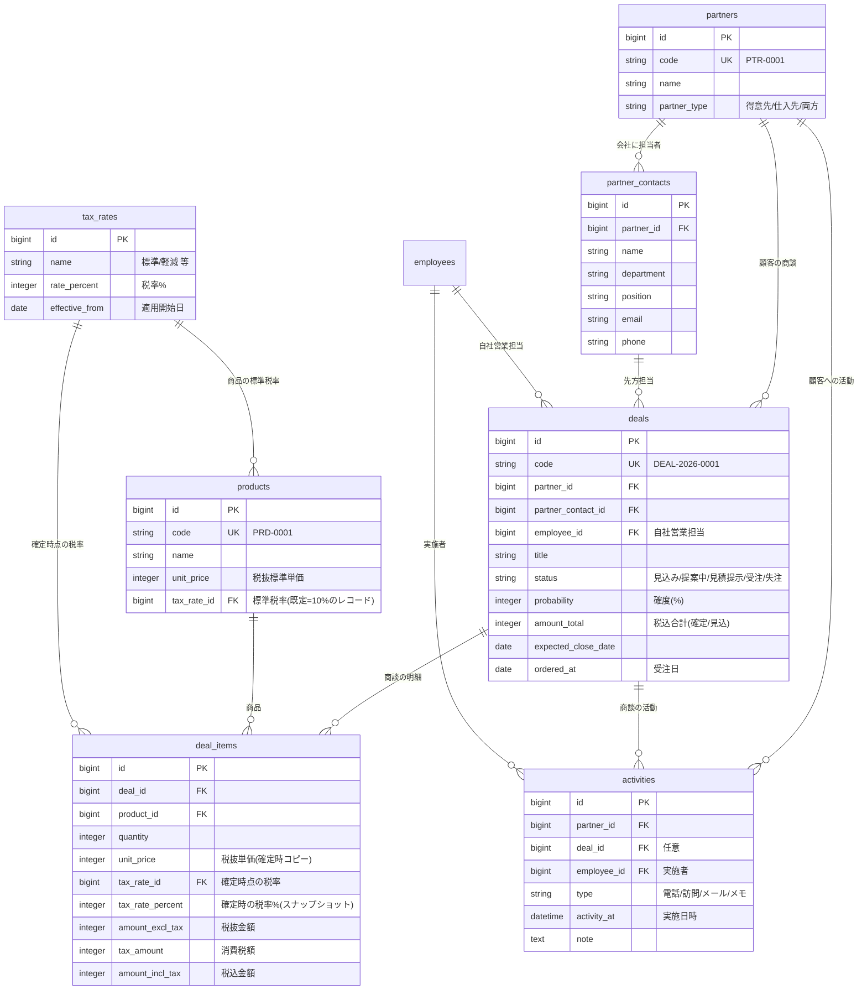

# CRM（営業・売上管理）基本設計書

> 業務システム共通基盤（`laravel-business-template`）を土台に構築する、BtoB法人営業向けの顧客・商談・売上管理システム。

## 1. 想定クライアント・課題

**想定クライアント**：BtoB向けにサービスを提供する中小企業（例：システム開発・広告・人材などの法人営業組織。従業員数十名規模）※架空設定。

**課題**：
- 顧客・商談・売上の情報が担当者ごとに分散し、会社全体で「いくら売れているか／これからいくら見込めるか」を把握しづらい。
- 商談の進捗（どの案件がどの段階か）が可視化されておらず、受注見込みが読めない。
- 金額・税の管理が属人的で、確定した売上金額の正確性に不安がある。

**このシステムの狙い**：顧客〜商談〜明細で金額を積み上げて一元管理し、一覧・詳細・ダッシュボードの各層で数値を確認しやすくする。特に**売上・見込み金額の可視化**と**金額の正確性（内税管理・税率の時点保全）**を主役に据える。

## 2. スコープ

**やること**：顧客（会社）と担当者個人の管理、商談（案件）とその明細による金額管理、営業プロセス（パイプライン）管理、活動履歴、売上ダッシュボード、税率マスタによる内税管理。

**やらないこと（今回のスコープ外）**：請求・入金消込、見積書/請求書のPDF発行、メール送信、他システム連携、複数通貨。※将来の拡張余地として設計上は妨げない。

## 3. 主要機能一覧

- **顧客管理**：会社（`partners`を利用）と担当者個人（`partner_contacts`）。顧客詳細で累計売上・進行中商談金額・受注残を集計表示。
- **商談管理**：商談（`deals`）の登録・編集。ステータス（見込み/提案中/見積提示/受注/失注）、確度、予定金額・受注金額、担当営業、予定クローズ日。
- **商談明細**：商品（`products`を利用）ごとの明細（`deal_items`）。数量・単価・税率・金額。明細合計＝商談金額。
- **パイプライン可視化**：ステータス別に商談と金額を俯瞰。
- **活動履歴**：顧客・商談に紐づく活動（`activities`：電話/訪問/メール/メモ）。
- **売上ダッシュボード**：月次売上推移、担当者別売上、ステータス別の見込み金額、今月の受注/見込み合計。
- **税率マスタ**：`tax_rates`（税率・適用開始日・名称）による内税管理。
- **一覧の共通機能**（基盤から継承）：検索・絞り込み・ソート・ページング・CSV出力・論理削除・権限制御。

## 4. 画面一覧

| 画面 | 主な内容 |
|---|---|
| ダッシュボード | 売上KPI（今月受注・見込み合計）、月次推移グラフ、担当者別・ステータス別金額 |
| 商談一覧 | 商談を金額・確度・ステータスで絞り込み/並べ替え。**上部に絞り込み結果の合計金額サマリ** |
| 商談詳細 | 商談情報＋明細（商品・数量・単価・税率・金額）＋**金額内訳（税抜/消費税/税込）**＋活動履歴 |
| 商談 登録/編集 | 顧客・担当・営業・ステータス・確度・クローズ日、明細の追加/編集 |
| 顧客一覧 | 会社の一覧。累計売上・進行中金額の列 |
| 顧客詳細 | 会社情報＋担当者一覧＋商談一覧＋**取引金額サマリ**＋活動履歴 |
| 担当者（partner_contacts）管理 | 会社に紐づく担当者個人のCRUD |
| マスタ | 税率マスタ、（基盤の）社員・取引先・商品マスタ |

## 5. データ設計（ER図）

共通基盤の `partners` / `products` / `employees` / `users` を親として活用し、CRM固有テーブルを追加する。全テーブルは基盤の共通カラム（`is_active` / `created_by` / `updated_by` / `created_at` / `updated_at` / `deleted_at`）を持つ。

## 6. 金額・税の設計（このシステムの核）

**方針：内税（税込）で売上を管理し、税率は時点ごとに保全する。**

- **税率マスタ `tax_rates`**：`rate_percent`（税率%）・`effective_from`（適用開始日）・`name`。プリセットとして「標準10%」を1件（既定用）投入。税率変更時は**マスタを書き換えず、新しい適用開始日のレコードを追加**する（例：2026-10-01 から 12%）。
- **商品マスタ `products`**：`tax_rate_id`（標準税率）を持ち、税率マスタから選択。未選択のまま保存された場合は、保存時に**既定の標準税率**を自動で割り当てる（NULL事故を防止）。既定の標準税率＝「名称が `標準`（`config/tax.php` の `default_rate_name`）のレコードのうち、基準日時点で適用中（`effective_from` が基準日以前）の最新世代」。同じ名称で新しい適用開始日のレコードを追加すれば、以後に登録する商品の既定はそちらに切り替わる。
- **商談明細 `deal_items`（過去データ保全の要）**：商品を明細に追加した時点の**単価・税率(%)をコピー保持**（`unit_price` / `tax_rate_percent`）。以後、商品マスタや税率マスタが変わっても、確定済み商談の金額は不変。
- **金額の内訳**：明細ごとに税抜金額・消費税額・税込金額を保持し、詳細画面で「税抜 / 消費税 / 税込」を表示。商談の `amount_total` は明細の税込合計。
- **端数処理**：消費税額は明細単位で計算し切り捨てで統一（READMEに明記）。

> この「商品マスタ＝これから使う標準税率／商談明細＝確定時点のスナップショット」という役割分担により、変動税率への対応と過去データの保全を両立する。

## 7. 主要な業務フロー

1. **商談の起票**：顧客（会社）と先方担当を選び、商談を作成（ステータス=見込み）。
2. **明細の追加**：商品を選ぶと、標準単価と標準税率が引き当てられ、数量入力で金額（税抜/税/税込）が自動計算。単価は案件ごとに変更可（値引き対応）。
3. **進捗更新**：提案中→見積提示…とステータスと確度を更新。活動履歴を記録。
4. **受注/失注**：受注時にステータス=受注・受注日を記録。この時点の明細金額が売上として確定。
5. **可視化**：ダッシュボードと一覧サマリで、受注済み・見込み金額を集計表示。

## 8. 権限設計

共通基盤のロールを踏襲。
- **admin**：全操作、削除済み表示・復元、マスタ管理、ユーザー管理。
- **staff**：商談・顧客・活動の登録/編集、CSV出力。削除済み表示・復元は不可。
- **viewer**：閲覧・CSV出力のみ。

## 9. 技術方針

- 共通基盤 `laravel-business-template` を clone して構築（Laravel 13 / PHP 8.3 / PostgreSQL 16 / Blade + Tailwind + Alpine / spatie権限 / BaseModel共通仕様 / 共通一覧基盤 / 監査ログ / Docker / Pint+Larastan+PHPUnit）。
- 商談コードは基盤の採番機構を用い、年度別キー（例：`deals:2026` → `DEAL-2026-0001`）で払い出す。
- 金額はすべて整数（最小通貨単位）で保持し、通貨誤差を避ける。※共通基盤から引き継いだ `products.unit_price` のみ `decimal(12,2)`。商談明細の実装時に整数へ統一するかを判断する（確定金額は `deal_items` 側に持つため、そこは整数で保持する）。
- 静的デモ（Vercel）は本設計の代表画面（ダッシュボード/商談一覧/商談詳細）をテーマ適用して見せる。

## 10. 静的デモ・仮想クライアント設定

- 仮想クライアント名・ロゴ・配色は共通基盤のテーマ差し替え機構で設定（例：架空の「〇〇ソリューションズ 営業管理」）。
- ポートフォリオには本設計書（GitHub）＋静的デモ（Vercel）＋ケーススタディを紐づけてリンクする。
